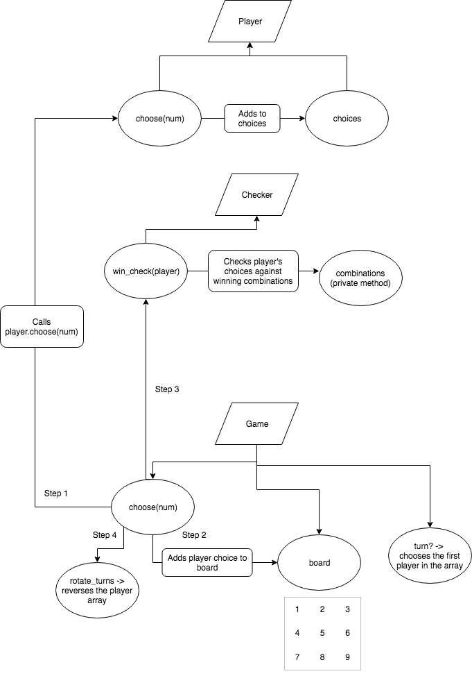

# Tictactoe

## by George Drayson

## Description

This was a practice tech test as part of the Makers Academy course.

### Rules

- There are two players in the game (X and O)
- Players take turns until the game is over
- A player can claim a field if it is not already taken
- A turn ends when a player claims a field
- A player wins if they claim all the fields in a row, column or diagonal
- A game is over if a player wins
- A game is over when all fields are taken

## Get started

Clone this repository. Then, type:
```
pytest
```

## Domain model:



## User stories

```
As a user,
So that I can choose a field,
I would like to select a field by number.

As a user,
So that I can know if I have won or lost,
I would like to see a congratulations message.

As a user,
So that I can know if the game is over,
I would like to see a game over message.

As a user,
So that I can see if it is my turn,
I would like to see a message of the current turn.

```

## Built With

* [Python](https://www.python.org/) - Language
* [Pytest](https://docs.pytest.org/en/latest/) - The testing framework
* [Atom](https://atom.io/) - Text editor
